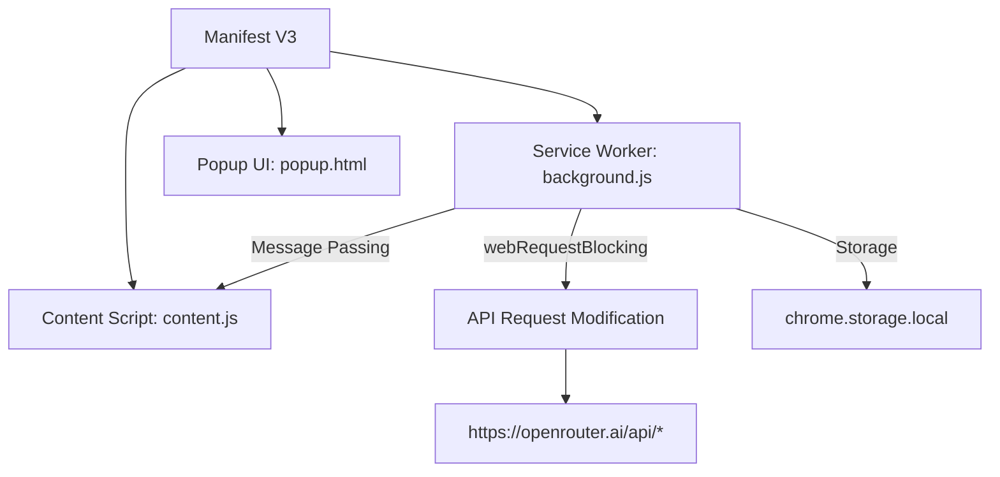
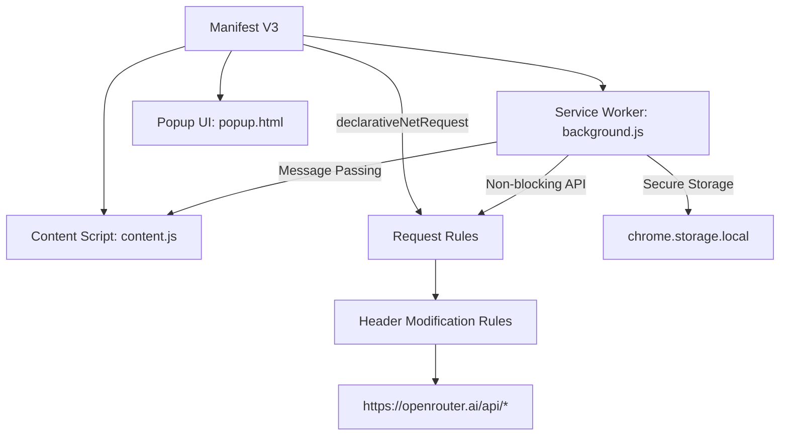

# Manifest V3 Compliance Architecture Plan

## Current Architecture Overview


## Key Compliance Issues
1. **webRequestBlocking Usage**: Manifest V3 prohibits blocking webRequest listeners
2. **Service Worker Optimization**: Ensure efficient lifecycle management
3. **CSP Enforcement**: Strict content security policy requirements
4. **Command API Implementation**: Proper declarative command handling

## Proposed Architecture


## Implementation Strategy

### 1. Replace webRequestBlocking with declarativeNetRequest
**manifest.json updates:**
```json
{
  "permissions": [
    "activeTab",
    "scripting",
    "storage",
    "declarativeNetRequest",
    "https://openrouter.ai/api/*"
  ],
  "declarative_net_request": {
    "rule_resources": [{
      "id": "header_rules",
      "enabled": true,
      "path": "rules.json"
    }]
  }
}
```

**rules.json (new file):**
```json
[
  {
    "id": 1,
    "priority": 1,
    "action": {
      "type": "modify_headers",
      "request_headers": [
        {
          "header": "Authorization",
          "operation": "set",
          "value": "Bearer <API_KEY>"
        },
        {
          "header": "X-Content-Type-Options",
          "operation": "set",
          "value": "nosniff"
        }
      ]
    },
    "condition": {
      "url_filter": "https://openrouter.ai/api/*",
      "resource_types": ["xmlhttprequest"]
    }
  }
]
```

### 2. Service Worker Optimization
**background.js updates:**
- Remove webRequest listener
- Add rule registration logic:
```javascript
// Initialize declarative rules
async function initializeHeaderRules() {
  try {
    const apiKey = await getStoredApiKey();
    if (apiKey) {
      await chrome.declarativeNetRequest.updateDynamicRules({
        addRules: [{
          id: 1,
          priority: 1,
          action: {
            type: "modify_headers",
            requestHeaders: [
              { header: "Authorization", operation: "set", value: `Bearer ${apiKey}` },
              { header: "X-Content-Type-Options", operation: "set", value: "nosniff" }
            ]
          },
          condition: {
            urlFilter: "https://openrouter.ai/api/*",
            resourceTypes: ["xmlhttprequest"]
          }
        }]
      });
    }
  } catch (error) {
    console.error('Rule initialization failed:', error);
  }
}

// Update API key handling to refresh rules
async function refreshApiHeaderRule() {
  const apiKey = await getStoredApiKey();
  if (apiKey) {
    await chrome.declarativeNetRequest.updateDynamicRules({
      updateRules: [{
        id: 1,
        action: {
          type: "modify_headers",
          requestHeaders: [
            { header: "Authorization", operation: "set", value: `Bearer ${apiKey}` }
          ]
        }
      }]
    });
  }
}
```

### 3. Content Security Policy Adjustments
**manifest.json updates:**
```json
{
  "content_security_policy": {
    "extension_pages": "script-src 'self' 'wasm-unsafe-eval'; object-src 'self'; connect-src 'self' https://openrouter.ai/api/*"
  }
}
```

### 4. Command API Implementation
**manifest.json updates:**
```json
{
  "commands": {
    "toggle-extension": {
      "suggested_key": {
        "default": "Ctrl+Shift+O",
        "mac": "Command+Shift+O"
      },
      "description": "Toggle extension overlay"
    },
    "clear-cache": {
      "suggested_key": {
        "default": "Ctrl+Shift+C",
        "mac": "Command+Shift+C"
      },
      "description": "Clear local storage cache"
    }
  }
}
```

## Migration Steps
1. Create rules.json file with header modification rules
2. Update manifest.json with new permissions and CSP
3. Modify background.js to use declarativeNetRequest
4. Test header modification functionality
5. Verify command functionality with new manifest declarations
6. Validate service worker lifecycle events